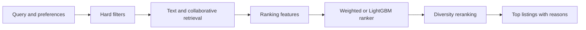

# Hybrid Property Recommender with MLOps

A property recommendation project for Berlin short-stay listings. It combines content retrieval, review-history signals, ranking, offline evaluation, a FastAPI service and a React/Mapbox interface.

The real dataset comes from [Inside Airbnb](https://insideairbnb.com/get-the-data/). The repository does not include the downloaded data or a trained model.

## What this project shows

- Two-stage recommendation: candidate retrieval followed by ranking
- TF-IDF text features with FAISS vector lookup and a NumPy fallback
- Item-to-item collaborative signals from users who reviewed more than one listing
- A weighted baseline and an optional LightGBM LambdaRank model
- Cold-start results from listing metadata, rating, popularity and availability
- Precision@K, Recall@K, MAP@K, NDCG@K and catalogue coverage
- MLflow experiment tracking and saved model artifacts
- FastAPI endpoints with typed requests and responses
- React filters, saved items, comparison, explanations and an interactive map
- Python, API and frontend build tests

## Data

The download script uses the Berlin snapshot dated 26 June 2026:

- `listings.csv.gz` for listing text, room type, nightly price, amenities, rating and coordinates
- `reviews.csv.gz` for positive user-item history
- `neighbourhoods.geojson` for Berlin boundaries

Inside Airbnb provides this data under CC BY 4.0. Reviewer IDs are salted and hashed during preparation. Reviewer names and review text are not stored.

A review is only a proxy for positive feedback. It does not give impressions, dislikes, saves or booking conversion, so this project should not claim production-level recommendation quality.

## Recommendation flow



The weighted ranker works without training and is the default serving model. Training creates `artifacts/models/lgbm_ranker.joblib`. Set `USE_LEARNED_RANKER=true` only after its offline metrics beat the baseline.

## Project structure

```text
├── configs/                       # Data, training and API settings
├── data/
│   ├── raw/                      # Downloaded files, ignored by Git
│   ├── processed/                # Model-ready files, ignored by Git
│   └── sample/                   # Small sample data
├── notebooks/
│   ├── 01_data_exploration.ipynb
│   ├── 02_features_and_baselines.ipynb
│   ├── 03_hybrid_retrieval_and_ranking.ipynb
│   └── 04_evaluation_and_error_analysis.ipynb
├── src/
│   └── app/
│       ├── apis/                 # FastAPI routes
│       ├── data/                 # Load and clean data
│       ├── features/             # Property and user features
│       ├── retrieval/            # Search candidates
│       ├── ranking/              # Rank candidates
│       ├── recommendation/       # Final results and reasons
│       ├── evaluation/           # Ranking metrics
│       ├── pipelines/            # Prepare, train and evaluate
│       ├── monitoring/           # Drift and service metrics
│       └── main.py               # FastAPI entry point
├── frontend/
│   ├── app/                      # Next.js pages and styles
│   ├── components/               # React UI and Mapbox map
│   └── public/                   # Images and favicon
├── scripts/                      # Download, train, evaluate and serve
├── tests/                        # Unit and integration tests
├── docs/                         # Architecture and model notes
└── artifacts/                    # Local indexes and trained models
```

There is one Python package under `src/app`. The frontend is separate under
`frontend`.

## Run locally

Use Python 3.11+ and Node 22+.

```bash
python -m venv .venv
source .venv/bin/activate
pip install -e ".[ml,dev]"
cp .env.example .env
cp frontend/.env.example frontend/.env.local
cd frontend
npm ci
cd ..
```

Download and prepare the real data:

```bash
python scripts/download_data.py
python -m app.pipelines.prepare_data
```

Train and evaluate:

```bash
python scripts/train.py --skip-prepare --max-users 1500
python scripts/evaluate.py --k 10 --max-users 500
mlflow ui
```

The evaluation writes `artifacts/evaluation.json`. The current review-only experiment did not beat the baseline, so the learned model is trained but not promoted. See [docs/evaluation.md](docs/evaluation.md).

Start the API and web app in two terminals:

```bash
uvicorn app.main:app --app-dir src --reload
```

```bash
cd frontend
npm run dev
```

Open `http://localhost:8000/docs` for the API and `http://localhost:3000` for the UI. If the API is offline, the UI keeps the current results.

## Mapbox

Mapbox fits this project because property results need styled markers, popups, bounds and smooth map interactions. Put a public token in `frontend/.env.local` as `NEXT_PUBLIC_MAPBOX_TOKEN`. Restrict the token to your site URL before deployment. Do not put a secret token in frontend code.

The map requires this Mapbox token. There is no second map provider or tile fallback.

## API example

```bash
curl -X POST http://localhost:8000/api/v1/recommendations \
  -H "Content-Type: application/json" \
  -d '{
    "query": "entire apartment in Berlin with Wifi and kitchen",
    "city": "Berlin",
    "max_budget": 180,
    "bedrooms": 2,
    "property_types": ["Entire home/apt"],
    "amenities": ["Wifi", "Kitchen", "Washer"],
    "top_k": 5
  }'
```

## Checks

```bash
pytest
ruff check src tests scripts
cd frontend
npm run lint
npm run test
```

See [TODO.md](TODO.md) for four practical next steps.
